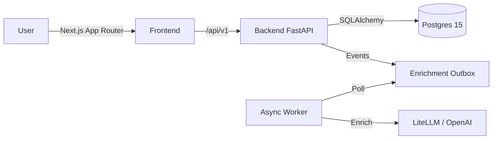

# LiteVault

> **Store lightly. Recall instantly.**
> A friction-free, AI-enriched second brain for hackers.


**LiteVault** is an open-source knowledge management tool built for the "capture now, organize later" workflow. It uses a background AI worker to clean, tag, and summarize your raw thoughts, but strictly keeps you in the loop for final confirmation.

## The Loop

1.  **Capture**: Drop a raw note (`#idea needs research`) into the void. Instant 201 Created.
2.  **Enrich**: Async worker generates a title, summary, and suggested tags via LLM.
3.  **Review**: You accept/reject the AI's labels. Human-in-the-loop.
4.  **Library**: A clean timeline of your confirmed knowledge.
5.  **Search**: Fast lexical search (`#tag` or text) via Postgres `pg_trgm`.

## Architecture

Simplified view of the V1 stack:



## Features (V1 Current)

*   **Zero-Friction Capture**: <200ms API response time.
*   **AI Enrichment**: Auto-tagging and summarization (Outbox pattern).
*   **Tag Management**: Soft-deletes, colors, upsert logic, merging.
*   **Search**: Hybrid mode (Tag-only ` #tag` vs. Combined Text).
*   **Auth**: Secure access via Clerk (Frontend) + JWT Validation (Backend).
*   **Quotas**: Rate limiting and daily AI usage caps per user plan.

## Roadmap & Status

| Phase | Focus | Status |
| :--- | :--- | :--- |
| **V1.0** | Core Capture loop, Auth, Tags, Library | :white_check_mark: Live |
| **V1.1** | Mobile polish, Exports, Analytics | :construction: In Progress |
| **V2.0** | Semantic Search (Vector), Clustering | :crystal_ball: Planned |
| **V3.0** | Knowledge Graph, Spaced Repetition | :crystal_ball: Future |

See [Product Requirements (V1)](docs/prd/PRD_LiteVault.en-US.md) for details.

## Repo Layout

```
/LiteVault
├── /backend        # FastAPI, SQLAlchemy, Alembic, LiteLLM
├── /frontend       # Next.js 15, shadcn/ui, React Query
├── /docs           # Canonical documentation
│   ├── /architecture  # Data models, API contracts
│   ├── /design        # UI specs, Microcopy
│   └── /prd           # Product requirements
└── /docker         # Container config
```

## Quickstart (Local Dev)

### Prereqs
*   Node.js 18+ & npm
*   Python 3.11+ & [uv](https://github.com/astral-sh/uv)
*   Postgres 15+ (local or Docker)
*   Clerk Account (for auth keys)

### 1. Backend

```bash
cd backend
cp .env.example .env            # Configure DB_URL and CLERK_KEYS
uv sync                         # Install dependencies
uv run alembic upgrade head     # Run migrations
uv run uvicorn app.main:app --reload --port 8080
```

### 2. Frontend

```bash
cd frontend
cp .env.example .env.local      # Configure NEXT_PUBLIC_CLERK_KEY
npm install
npm run dev
# Open http://localhost:3000
```

## Configuration

*   **Auth**: Set `AUTH_MODE=clerk` in backend for prod, or `mixed` for dev.
*   **LLM**: Supports any provider via `litellm`. Set `LLM_PROVIDER=openai` (or `stub` for free testing).

## Documentation

*   **API Contract**: [RAML/Spec V1](docs/architecture/API_CONTRACT_V1.md)
*   **Data Model**: [Schema V1](docs/architecture/data_model_v1.md)
*   **UI/UX Spec**: [Interaction Guide](docs/design/UI_INTERACTION_SPEC.md)

## Contributing

We like clean code and short PRs. See [CONTRIBUTING.md](CONTRIBUTING.md).

## Security

Found a bug? See [SECURITY.md](SECURITY.md).

## License

[MIT](LICENSE)