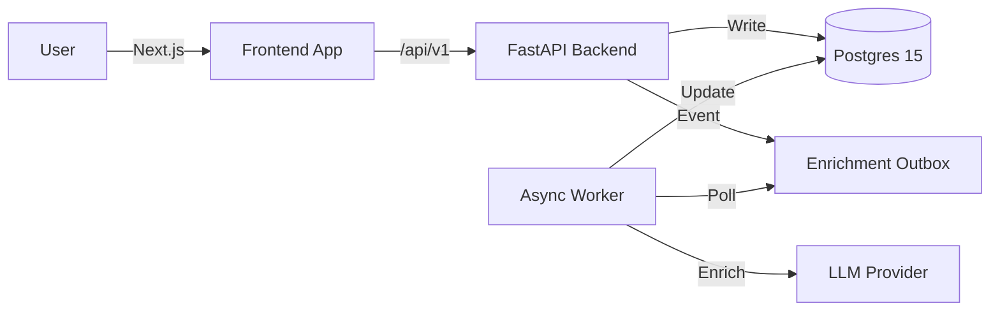
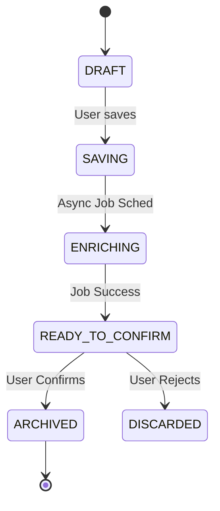

# LiteVault

English | [简体中文](./README.zh-CN.md)

> **Capture. Connect. Recall.**
> A friction-free, AI-enriched second brain for hackers.


**LiteVault** is an open-source knowledge management tool designed for the "capture now, organize later" workflow. It offloads the cognitive load of tagging and summarizing to a background AI worker, while strictly keeping the user in the loop for final confirmation.

---

### Table of Contents
- [The Loop](#the-loop)
- [Architecture](#architecture)
- [Features](#features)
- [Quickstart](#quickstart)
- [Configuration](#configuration)
- [Documentation](#documentation)

---

## The Loop

1.  **Capture**: Drop a rough note (`#idea needs research`) into the void. Instant 201 Created.
2.  **Enrich**: Background worker extracts metadata, generates a summary, and suggests tags.
3.  **Review**: You accept or reject the AI's suggestions. **Human-in-the-loop.**
4.  **Recall**: Search instantly via tags (`#dev`) or fuzzy text match.

## Architecture

LiteVault separates the capture plane (latency-sensitive) from the enrichment plane (compute-intensive).



### Item Lifecycle

State machine enforcing the "Enrichment" -> "Review" -> "Archive" flow (see [State Specs](docs/architecture/state_machine.md)).



## Features

### :white_check_mark: Current (V1)
*   **Zero-Latnecy Capture**: Optimistic UI with background processing.
*   **AI Enrichment**: Auto-summarization and tag suggestions via `litellm`.
*   **Tag Management**: Upsert logic, soft-deletes, and color coding.
*   **Hybrid Search**: Tag-based filtering + `pg_trgm` fuzzy text search.
*   **Auth**: Secure identity via Clerk + Backend JWT validation.
*   **Quotas**: Daily usage limits for AI features.

### :crystal_ball: Roadmap
*   **V1.1**: Mobile PWA polish, Data exports, Tag analytics.
*   **V2.0**: Semantic Search (pgvector) and Automated Clustering.
*   **V3.0**: Knowledge Graph visualization and Spaced Repetition.

## Repo Layout

```
/LiteVault
├── /backend        # Python/FastAPI (Managed by uv)
├── /frontend       # TypeScript/Next.js (Managed by npm)
├── /docs           # Canonical Architecture & PRDs
└── /docker         # Container definitions
```

## Quickstart

### Prerequisites
*   Node.js 18+ & npm
*   Python 3.11+ & [uv](https://github.com/astral-sh/uv)
*   Postgres 15+ (Local or Docker)
*   Clerk Account (Free tier)

### Backend (Port 8000)

```bash
cd backend
cp .env.example .env            # Set DB_URL and CLERK_SECRET_KEY
uv sync                         # Install dependencies
uv run alembic upgrade head     # Run DB migrations
uv run uvicorn app.main:app --reload --port 8000
```

### Frontend (Port 3000)

```bash
cd frontend
cp .env.example .env.local      # Set NEXT_PUBLIC_CLERK_PUBLISHABLE_KEY
npm install
npm run dev
```

## Configuration

| Variable | Description | Default |
| :--- | :--- | :--- |
| `AUTH_MODE` | Backend auth strategy | `clerk` (prod) / `mixed` (dev) |
| `LLM_PROVIDER` | AI Service | `openai` / `anthropic` / `stub` |
| `DB_URL` | Postgres Connection | `postgresql+asyncpg://...` |

## Documentation

*   **[API Contract V1](docs/architecture/API_CONTRACT_V1.md)**: Endpoints, DTOs, and Error Codes.
*   **[Data Model](docs/architecture/data_model_v1.md)**: Schema definitions and relationships.
*   **[UI Interaction Spec](docs/design/UI_INTERACTION_SPEC.md)**: Frontend behaviors and states.
*   **[Product Requirements](docs/prd/PRD_LiteVault.en-US.md)**: Product vision and roadmap.

## Contributing

See [CONTRIBUTING.md](CONTRIBUTING.md) for branch naming and PR standards.

## Security

Please report vulnerabilities via email. See [SECURITY.md](SECURITY.md).

## License

[MIT](LICENSE)