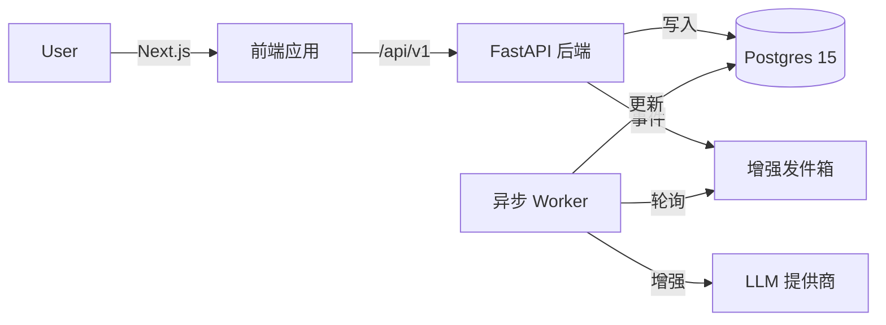
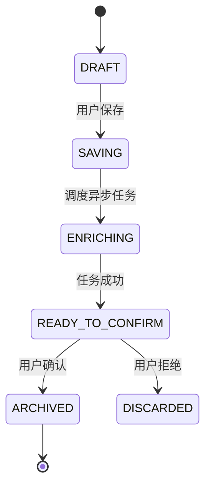

# LiteVault

简体中文 | [English](./README.md)

> **捕捉. 连接. 回忆.**
> 为极客打造的无摩擦、AI 增强的各种想法的第二大脑。


**LiteVault** 是一款专为“先记录，后整理”工作流设计的开源知识管理工具。它通过后台 AI 工作者自动处理打标签和总结等繁琐工作，从而减轻认知负担，同时严格保留用户进行最终确认的控制权。

---

### 目录 (Table of Contents)
- [核心循环 (The Loop)](#核心循环-the-loop)
- [架构 (Architecture)](#架构-architecture)
- [功能特性 (Features)](#功能特性-features)
- [快速开始 (Quickstart)](#快速开始-quickstart)
- [配置 (Configuration)](#配置-configuration)
- [文档 (Documentation)](#文档-documentation)

---

## 核心循环 (The Loop)

1.  **捕捉 (Capture)**：将粗略的想法（如 `#idea 需要调研`）扔进虚空。瞬间返回 `201 Created`。
2.  **增强 (Enrich)**：后台工作者提取元数据、生成摘要并由 LLM 建议标签。
3.  **审核 (Review)**：你接受或拒绝 AI 的建议。**人机协同 (Human-in-the-loop)。**
4.  **回忆 (Recall)**：通过标签（如 `#dev`）或模糊文本匹配即时搜索。

## 架构 (Architecture)

LiteVault 将（对延迟敏感的）捕捉平面与（计算密集型的）增强平面分离开来。



### 条目生命周期

强制执行“增强” -> “审核” -> “归档”流程的状态机（参见 [状态规范](docs/architecture/state_machine.md)）。



## 功能特性 (Features)

### :white_check_mark: 当前 (V1)
*   **零延迟捕捉**：即时响应的乐观 UI 与后台处理。
*   **AI 增强**：通过 `litellm` 自动生成摘要和推荐标签。
*   **标签管理**：Upsert 逻辑、软删除和颜色编码。
*   **混合搜索**：基于标签的过滤 + `pg_trgm` 模糊文本搜索。
*   **身份认证**：通过 Clerk 安全认证 + 后端 JWT 验证。
*   **配额限制**：AI 功能的每日使用限制。

### :crystal_ball: 路线图 (Roadmap)
*   **V1.1**: 移动端 PWA 打磨, 数据导出, 标签分析。
*   **V2.0**: 语义搜索 (pgvector) 和自动聚类。
*   **V3.0**: 知识图谱可视化和间隔重复 (Spaced Repetition)。

## 仓库布局 (Repo Layout)

```
/LiteVault
├── /backend        # Python/FastAPI (使用 uv 管理)
├── /frontend       # TypeScript/Next.js (使用 npm 管理)
├── /docs           # 权威架构文档 & PRDs
└── /docker         # 容器定义
```

## 快速开始 (Quickstart)

### 前置要求
*   Node.js 18+ & npm
*   Python 3.11+ & [uv](https://github.com/astral-sh/uv)
*   Postgres 15+ (本地或 Docker)
*   Clerk 账户 (免费版)

### 后端 (端口 8000)

```bash
cd backend
cp .env.example .env            # 设置 DB_URL 和 CLERK_SECRET_KEY
uv sync                         # 安装依赖
uv run alembic upgrade head     # 运行数据库迁移
uv run uvicorn app.main:app --reload --port 8000
```

### 前端 (端口 3000)

```bash
cd frontend
cp .env.example .env.local      # 设置 NEXT_PUBLIC_CLERK_PUBLISHABLE_KEY
npm install
npm run dev
```

## 配置 (Configuration)

| 变量 | 描述 | 默认值 |
| :--- | :--- | :--- |
| `AUTH_MODE` | 后端认证策略 | `clerk` (生产) / `mixed` (开发) |
| `LLM_PROVIDER` | AI 服务 | `openai` / `anthropic` / `stub` |
| `DB_URL` | Postgres 连接串 | `postgresql+asyncpg://...` |

## 文档 (Documentation)

*   **[API 契约 V1](docs/architecture/API_CONTRACT_V1.md)**: 端点、DTO 和错误代码。
*   **[数据模型](docs/architecture/data_model_v1.md)**: 模式定义和关系。
*   **[UI 交互规范](docs/design/UI_INTERACTION_SPEC.md)**: 前端行为和状态。
*   **[产品需求文档 (PRD)](docs/prd/PRD_LiteVault.zh-CN.md)**: 产品愿景和路线图。

## 贡献 (Contributing)

参见 [CONTRIBUTING.md](CONTRIBUTING.md) 了解分支命名和 PR 标准。

## 安全 (Security)

发现漏洞请通过邮件报告。参见 [SECURITY.md](SECURITY.md)。

## 许可证 (License)

[MIT](LICENSE)
