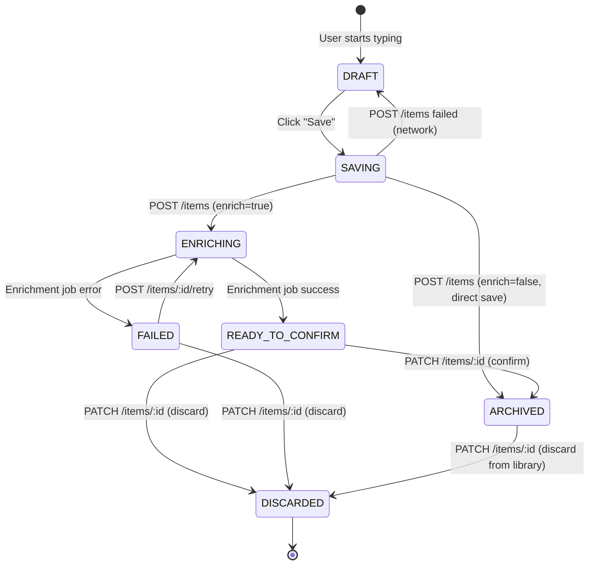
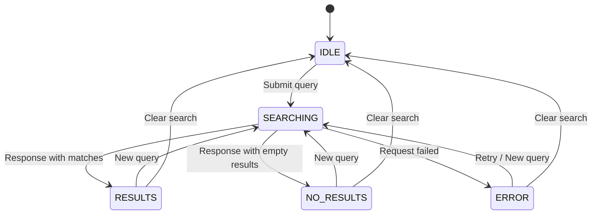
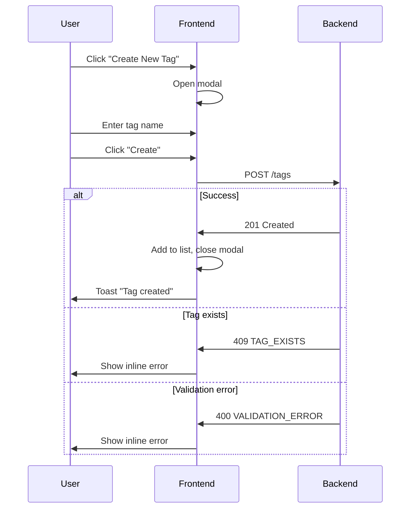
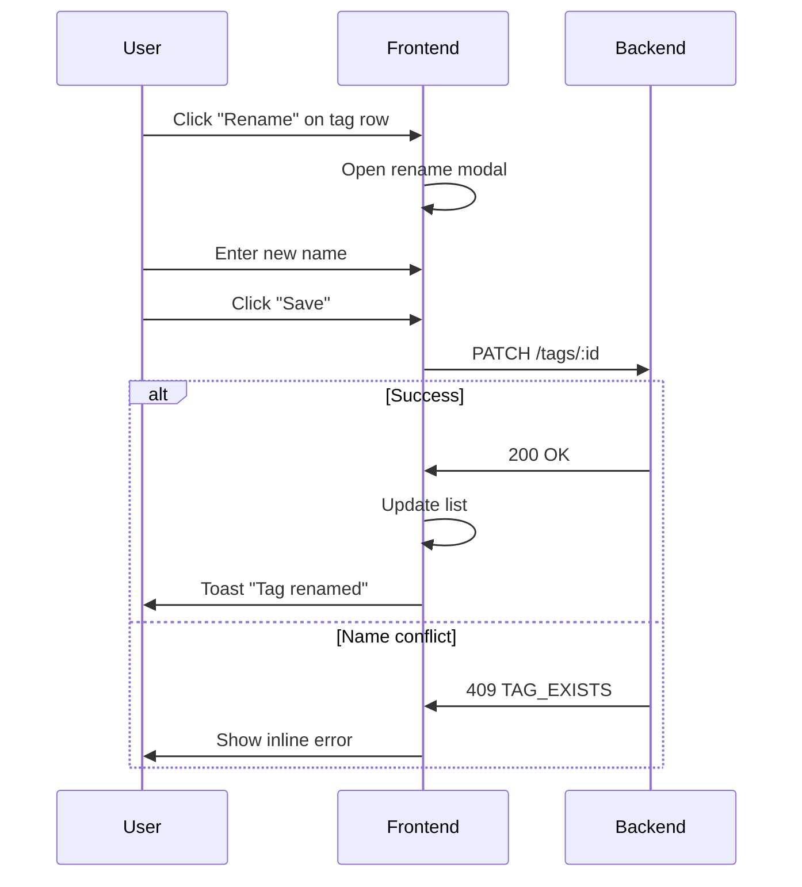
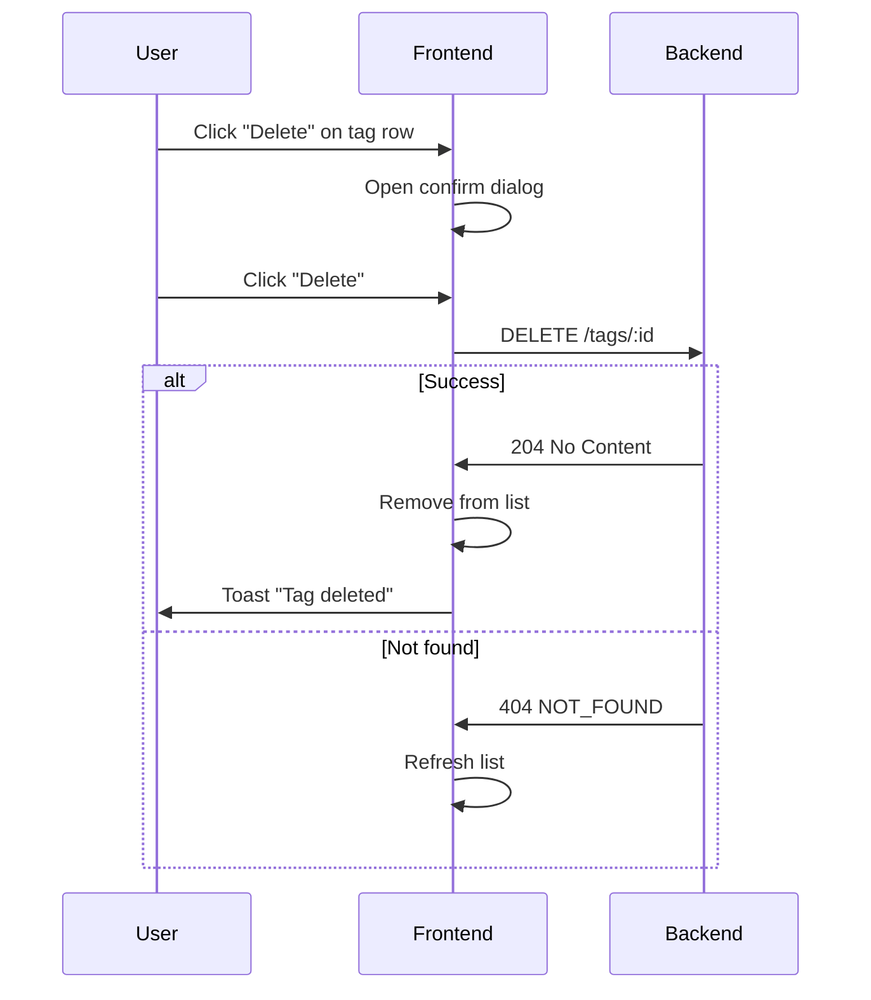
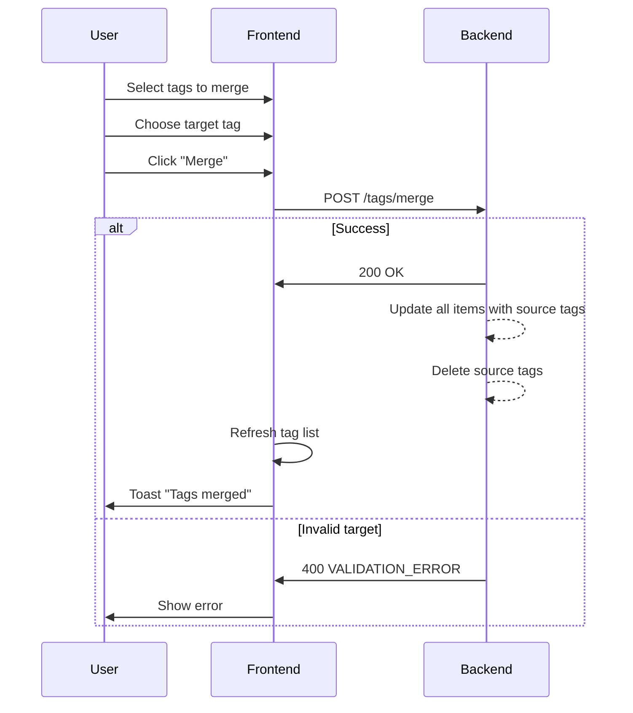

# LiteVault State Machines

> State machine definitions for LiteVault domain entities
> Aligned with frontend UI states and backend transitions

---

## 1. Item Lifecycle State Machine

### States

| State | Location | Description |
|-------|----------|-------------|
| `DRAFT` | Frontend only | User is typing, not yet saved |
| `SAVING` | Frontend only | POST /items in flight |
| `ENRICHING` | Backend | AI enrichment job running |
| `READY_TO_CONFIRM` | Backend | Enrichment complete, awaiting user action |
| `FAILED` | Backend | Enrichment failed, can retry |
| `ARCHIVED` | Backend | User confirmed, saved to library |
| `DISCARDED` | Backend | User discarded the item |

### State Diagram



### Transitions

| From | To | Trigger | Endpoint |
|------|-----|---------|----------|
| DRAFT | SAVING | User clicks Save | (frontend state) |
| SAVING | ENRICHING | API returns 201 (enrich=true) | `POST /items` |
| SAVING | ARCHIVED | API returns 201 (enrich=false) | `POST /items` |
| SAVING | DRAFT | API error | (frontend state) |
| ENRICHING | READY_TO_CONFIRM | Async job success | (backend job) |
| ENRICHING | FAILED | Async job error | (backend job) |
| READY_TO_CONFIRM | ARCHIVED | User confirms | `PATCH /items/:id` action=confirm |
| READY_TO_CONFIRM | DISCARDED | User discards | `PATCH /items/:id` action=discard |
| FAILED | ENRICHING | User retries | `POST /items/:id/retry` |
| FAILED | DISCARDED | User discards | `PATCH /items/:id` action=discard |
| ARCHIVED | DISCARDED | User discards from library | `PATCH /items/:id` action=discard |

### Invalid Transitions

These transitions should return `409 INVALID_STATE_TRANSITION`:

| From | Attempted | Why Invalid |
|------|-----------|-------------|
| ENRICHING | confirm | Must wait for enrichment |
| ENRICHING | discard | Must wait for enrichment |
| ARCHIVED | confirm | Already archived |
| DISCARDED | * | Terminal state |

### Async Enrichment Job Behavior

```
┌─────────────────────────────────────────────────────────┐
│                    POST /items                          │
│                         │                               │
│                         ▼                               │
│  ┌───────────────────────────────────────────────────┐  │
│  │  1. Create item with status: ENRICHING            │  │
│  │  2. Queue enrichment job                          │  │
│  │  3. Return 201 immediately                        │  │
│  └───────────────────────────────────────────────────┘  │
│                         │                               │
│                         ▼                               │
│  ┌───────────────────────────────────────────────────┐  │
│  │  ASYNC JOB (background)                           │  │
│  │  - Extract title from rawText                     │  │
│  │  - Generate summary via AI                        │  │
│  │  - Suggest tags via AI → item_tag_suggestions     │  │
│  │  - Detect sourceType (NOTE/ARTICLE)               │  │
│  │                                                   │  │
│  │  NOTE: Tags are stored as PENDING suggestions,    │  │
│  │  NOT in the tags table. Tags table is only        │  │
│  │  populated when user accepts during confirm.      │  │
│  └───────────────────────────────────────────────────┘  │
│                    │                │                   │
│               Success              Failure              │
│                    │                │                   │
│                    ▼                ▼                   │
│          READY_TO_CONFIRM        FAILED                │
└─────────────────────────────────────────────────────────┘
```

### Confirm Behavior (READY_TO_CONFIRM → ARCHIVED)

When user confirms an item:
1. **Accepted Suggestions**: Create/revive tags in `tags` table, create `item_tags` associations
2. **Rejected Suggestions**: Mark as REJECTED, no tags created
3. **Manual Tags**: Associate existing tags from `addedTagIds`
4. Transition item to ARCHIVED with `confirmed_at = NOW()`

### Retry Behavior

When `POST /items/:id/retry` is called:
1. Validate current state is `FAILED`
2. Update status to `ENRICHING`
3. Re-queue enrichment job
4. Return updated item

Max retries: 3 (configurable)
After max retries: Item remains in `FAILED`, user can manually edit or discard.

---

## 2. Search Request State Machine

### States (Frontend Only)

| State | Description |
|-------|-------------|
| `IDLE` | No query submitted, showing empty state |
| `SEARCHING` | Query submitted, waiting for response |
| `RESULTS` | Search successful, showing answer + evidence |
| `NO_RESULTS` | Search successful but no matches |
| `ERROR` | Search failed |

### State Diagram



### Transitions

| From | To | Trigger |
|------|-----|---------|
| IDLE | SEARCHING | User submits query |
| SEARCHING | RESULTS | API returns answer + evidence |
| SEARCHING | NO_RESULTS | API returns empty evidence array |
| SEARCHING | ERROR | API error or timeout |
| RESULTS | SEARCHING | User submits new query |
| NO_RESULTS | SEARCHING | User submits new query |
| ERROR | SEARCHING | User clicks Retry or submits query |
| * | IDLE | User navigates away |

### UI Rendering by State

| State | UI Behavior |
|-------|-------------|
| IDLE | Show greeting hero + search input |
| SEARCHING | Show skeleton for AnswerCard + EvidenceGrid |
| RESULTS | Show AnswerCard + EvidenceGrid + feedback buttons |
| NO_RESULTS | Show "No matches found" message + CTA |
| ERROR | Show error banner + Retry button |

---

## 3. Tag Management States

Tags are simpler entities without complex state machines. Here are the expected flows:

### Create Tag Flow



### Rename Tag Flow



### Delete Tag Flow



### Merge Tags Flow



---

## 4. Frontend State Mapping

### Item Card States (Home Page)

| Backend Status | Card Variant | UI Elements |
|----------------|--------------|-------------|
| `ENRICHING` | `skeleton` | Skeleton lines, spinner, "Enriching..." text |
| `READY_TO_CONFIRM` | `ready` | Title, summary, tags, "Ready to confirm" pill |
| `FAILED` | `failed` | Error icon, "Couldn't generate insight", Retry + Open buttons |

### Modal States (Insight Summary)

| Action | Modal State | Button State |
|--------|-------------|--------------|
| Open | View mode | "Confirm & Save" enabled |
| Confirming | Loading | "Saving..." disabled |
| Confirm success | Closed | - |
| Confirm error | View mode | Inline error shown |
| Discard click | Confirm dialog | - |
| Discard confirm | Closed | - |

---

## 5. Backend State Transition Validation

### Endpoint: `PATCH /items/:id`

```typescript
function validateStateTransition(
  currentStatus: ItemStatus,
  action: 'confirm' | 'discard' | 'edit'
): boolean {
  const allowedTransitions: Record<ItemStatus, string[]> = {
    ENRICHING: [],
    READY_TO_CONFIRM: ['confirm', 'discard', 'edit'],
    FAILED: ['discard'],
    ARCHIVED: ['edit'],
    DISCARDED: [],
  };

  return allowedTransitions[currentStatus]?.includes(action) ?? false;
}
```

### Endpoint: `POST /items/:id/retry`

```typescript
function canRetry(currentStatus: ItemStatus): boolean {
  return currentStatus === 'FAILED';
}
```

---

## 6. Summary: State Persistence

| State | Where Stored | Persisted |
|-------|--------------|-----------|
| DRAFT | Frontend (local) | No |
| SAVING | Frontend (local) | No |
| ENRICHING | Database | Yes |
| READY_TO_CONFIRM | Database | Yes |
| FAILED | Database | Yes |
| ARCHIVED | Database | Yes |
| DISCARDED | Database | Yes (soft delete) |

> **Note on DISCARDED**: V1 uses soft delete. Items with status `DISCARDED` are retained in the database but hidden from all queries except admin tools.
